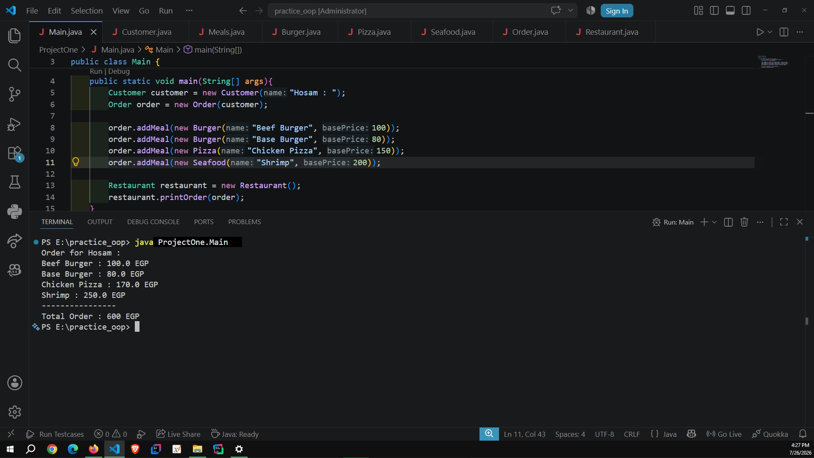

# Restaurant Ordering System (OOP Practice)

A simple Java project built to practice Object-Oriented Programming (OOP) concepts.



## Concepts Covered

- Encapsulation
- Inheritance
- Abstraction (Abstract Class)
- Polymorphism
- Composition (Has-A Relationship)
- Open/Closed Principle (OCP)

## Project Structure

```
ProjectOne/
│
├── Main.java
├── Customer.java
├── Meal.java (Abstract Class)
├── Burger.java
├── Pizza.java
├── Seafood.java
├── Order.java
└── Restaurant.java
```

## Class Responsibilities

- **Customer** → Stores customer information.
- **Meal** → Abstract base class for all meal types.
- **Burger / Pizza / Seafood** → Implement their own pricing logic.
- **Order** → Represents a customer's order and contains multiple meals.
- **Restaurant** → Displays the order details and calculates the total price.
- **Main** → Tests the system.

## Learning Objectives

- Practice Object-Oriented Programming (OOP)
- Understand Abstract Classes
- Apply Composition (Has-A)
- Apply Polymorphism
- Design for the Open/Closed Principle (OCP)
